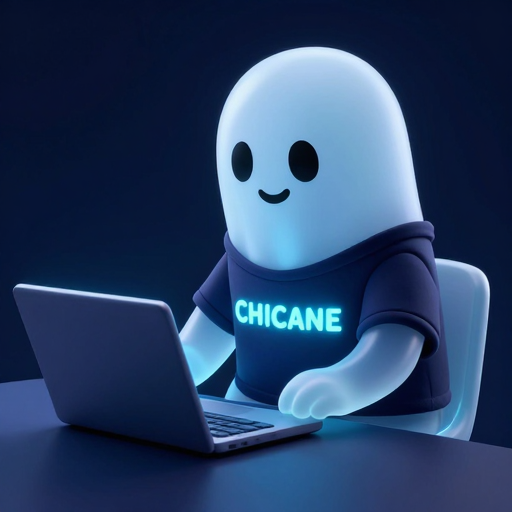

# Chicane Ghost — Character Identity Sheet

The official mascot/avatar for the Chicane project. Use this reference when generating any image featuring the Chicane ghost character.

## Reference Image



## Character Description

### Body
- **Shape:** Ghost blob — smooth, rounded dome top flowing into a wider body with a wavy translucent bottom edge that fades into nothing. No legs, no feet, no human body shape. Like an emoji ghost or Casper. Floating, not standing.
- **Material:** Pale blue-white, translucent with a soft inner luminescence. Subtle glow at the edges/outline. Semi-transparent ethereal quality with subsurface scattering — light passes through the body
- **Size:** Round and slightly chubby/plump — approachable, not thin or wispy
- **Surface:** Smooth, clean, no texture or patterns on the ghost body itself. Matte finish with soft subsurface scattering
- **CRITICAL:** The ghost must NOT look human. No human proportions, no human silhouette. It is a blob — a floating translucent shape with a dome top and wavy fading bottom. Think emoji ghost, Pac-Man ghost, or Casper.

### Face
- **Eyes:** Two large, perfectly round, solid black dot eyes. Positioned in the upper-middle area of the face, spaced apart roughly one eye-width. No pupils, no iris detail — just solid black circles. Tiny white highlight/reflection dot in the upper-right of each eye
- **Mouth:** Small, simple, slightly curved upward smile. Thin line, not open. Positioned below and between the eyes. Conveys quiet contentment and satisfaction — "someone who enjoys what they do"
- **Expression:** Relaxed, happy, at ease. Not excited or intense — calm and content. The kind of face that says "I'm vibing"
- **No other facial features** — no nose, no eyebrows, no ears, no blush marks

### Clothing (CRITICAL — most common failure point)
- **T-shirt:** Dark navy blue (#1A1F3A approximately) crew-neck t-shirt
- **Fit:** Fitted/snug around the round ghost body, not loose or baggy
- **Collar:** Visible round neckline where the dark fabric meets the pale ghost neck/head
- **Sleeves:** Short sleeves that wrap around the ghost's small stubby arms, ending roughly mid-upper-arm
- **Hem:** Visible bottom edge where the shirt ends and the bare ghost body continues below
- **3D GARMENT (ESSENTIAL):** The t-shirt MUST be a complete, fully enclosed 3D garment that wraps entirely around the ghost's round body — front panel, back panel, and visible side seams. From ANY angle other than dead-on front, the dark fabric of the back panel MUST be visible wrapping around the sides of the body. The shirt is NOT a bib, NOT an apron, NOT a flat graphic pasted on the front. It is a real tube of fabric encircling the torso. This is the single most important aspect of the character's appearance — without a proper wrapping t-shirt, the character looks wrong.
- **Material:** Opaque dark fabric — creates strong visual contrast against the pale translucent ghost body
- **Text:** "CHICANE" printed across the UPPER CHEST (dead center, well above the hem) in glowing electric blue (#4A9EFF approximately) letters. The text has a subtle neon glow effect. All caps, sans-serif font, horizontally centered on the chest. Text must NOT drift to the hem, shoulder, or sides.

### Arms & Hands
- **Arms:** Small, stubby, rounded arms extending from the sleeves. Short — proportionally small relative to the body
- **Hands:** Small rounded hands with subtle finger definition. Not detailed — more like soft mitten-like shapes with slight finger separation
- **Position varies by scene** — can be on a keyboard, resting on desk, gesturing, etc.

## Pose & Attitude

- **Posture:** Relaxed, upright, comfortable. Sitting back slightly — NOT hunched forward or intense
- **Vibe:** Someone who genuinely enjoys what they do. Calm confidence. Chill coder energy
- **The ghost floats** — wavy bottom edge fading into nothing, no contact with chair or surface. In seated scenes, the bottom edge hovers above the chair

## Scene Defaults

When depicting the ghost in its standard "at work" scene:

- **Desk:** Simple, dark surface (dark wood or dark matte material)
- **Laptop:** Open laptop in front of the ghost, screen facing the ghost. The laptop screen emits a soft blue glow that serves as the key light source illuminating the ghost from the front
- **Chair:** Simple dark chair, partially visible behind/beside the ghost
- **Background:** Solid deep navy (#0F1729) — clean, no clutter, no room details
- **Lighting:** Cinematic 3D lighting. Primary light from laptop screen (blue). Soft ambient fill. Subtle rim light on ghost edges. The overall mood is cozy, late-night coding session

## Camera & Composition

- **Default angle:** Three-quarter view from slightly to the right (approximately 30-45 degrees)
- **Zoom:** Tight crop — the ghost fills approximately 70-80% of the frame. Important for avatar/icon use at small sizes (48x48 pixels)
- **The ghost should be the dominant element** — desk, laptop, chair are supporting props, not the focus

## Rendering Style

- **Style:** Polished 3D character render. Not photorealistic, not flat vector — somewhere in between. Think Pixar/animated film quality miniature character
- **Shading:** Soft shadows, smooth gradients, no hard edges
- **Lighting model:** Subsurface scattering on the ghost body, proper 3D shadows, cinematic depth

## Color Palette

| Element | Color | Hex (approximate) |
|---------|-------|--------------------|
| Ghost body | Pale blue-white | #D8E8F8 |
| Ghost glow/edge | Soft blue-white | #B8D4F0 |
| Eyes | Solid black | #1A1A1A |
| T-shirt fabric | Dark navy | #1A1F3A |
| "CHICANE" text | Electric blue glow | #4A9EFF |
| Laptop glow | Blue | #3A8AEE |
| Desk surface | Dark charcoal | #2A2D35 |
| Background | Deep navy | #0F1729 |

## Prompt Template

When generating new images of the Chicane ghost, start with this base and modify for the specific scene:

```
Polished 3D character render, [CAMERA ANGLE AND COMPOSITION]. [SCENE ELEMENTS]. In the foreground center: a cute little ghost blob character, NOT human shaped. The ghost is a smooth rounded translucent pale blue-white glowing blob with a dome top, two big round black dot eyes with white highlights, and a sweet little curved smile. The bottom of the ghost is wavy and translucent, fading into nothing — no legs, no feet, no human body shape, just a floating ghostly blob like an emoji ghost. Wearing a dark navy t-shirt with CHICANE in glowing electric blue — C-H-I-C-A-N-E seven letters. [HANDS/ARMS DESCRIPTION]. [ADDITIONAL ELEMENTS]. Deep navy background (#0F1729). Ghost fills 50% of frame height.
```

## Common Prompt Mistakes (Anti-Patterns)

These issues recur across generations. Always guard against them explicitly in prompts:

### T-shirt becomes a dress/tunic
**Problem:** The t-shirt loses its fitted garment structure and drapes loosely like a tunic, poncho, or dress — especially when the ghost is standing or in wide shots.
**Fix:** Always include: "fitted snug crew-neck t-shirt with a visible round collar at the neckline, short sleeves ending at mid-arm, and a clear hem where the shirt ends and bare ghost body continues below. The t-shirt is NOT a dress or tunic — it covers only the upper torso."

### Mouth becomes an open oval
**Problem:** Instead of the small thin-line smile, the model renders a large open oval or "O" mouth, giving the ghost a surprised/generic emoji look.
**Fix:** Always include: "small thin closed-mouth smile, a simple curved line — NOT an open mouth, NOT an oval, NOT an O shape."

### Ghost body too opaque/solid
**Problem:** The ghost body renders as solid white plastic with no translucency or ethereal quality.
**Fix:** Include: "pale blue-white body with soft inner luminescence and gentle glow at the edges, translucent ethereal quality." For scenes where translucency matters, add: "ghost body has subsurface scattering, softly glowing from within."

### Arms/hands become blobs
**Problem:** Instead of defined stubby arms with mitten-like hands, the ghost gets shapeless nubs or blob appendages with no distinction between arm and hand.
**Fix:** Always include: "small stubby arms extending from the short sleeves, ending in small rounded mitten-like hands with subtle finger definition."

### Proportions shift in wide shots
**Problem:** When the composition is wider (full scene with props), the ghost becomes too small, proportions shift, and details (face, text, shirt) get lost.
**Fix:** For scenes with props/environment: "the ghost character is the dominant element, filling at least 50% of the frame height. Props and environment are secondary."

### T-shirt text drifts or misaligns
**Problem:** The "CHICANE" text drifts to the lower edge of the shirt, sits off-center, or appears at an angle — especially when the ghost is leaning forward or interacting with props below frame.
**Fix:** Always include: "CHICANE text centered horizontally and vertically on the upper chest area of the t-shirt, not near the hem, not at the neckline — dead center of the shirt front."

### T-shirt becomes a flat bib/apron
**Problem:** Instead of wrapping fully around the ghost's body as a 3D garment, the t-shirt renders as a flat piece draped over the front only — like a bib or apron. The ghost's bare body is visible behind/beside the shirt. No back panel, no side seams, no 3D garment construction.
**Fix:** Always include: "The t-shirt is a complete 3D garment that fully wraps around the ghost's round body — front panel, back panel, and visible side seams. From a three-quarter view, the dark fabric of the back panel should be visible wrapping around the sides. The shirt is NOT a bib, NOT an apron, NOT a flat piece on the front — it is a fully enclosed tube of fabric around the torso."

### Over-describing the t-shirt makes it worse
**Problem:** When the prompt says things like "fitted dark navy crew-neck t-shirt wrapping fully around its round body as a 3D garment — visible collar, short sleeves, back panel visible from the side", the model often renders the shirt as a flat piece hovering in front of the body rather than a properly worn garment. The excessive detail about "wrapping" and "3D garment" paradoxically breaks the rendering.
**Fix:** Keep the t-shirt description simple. Just say "dark navy t-shirt" or "wearing a dark navy t-shirt". The simpler the description, the more natural the rendering. Only add detail if the shirt is rendering as a bib/apron in results — and even then, prefer "properly worn t-shirt" over lengthy technical descriptions.

## Usage Notes

- Always spell out "CHICANE" (C-H-I-C-A-N-E, seven letters) and emphasize correct spelling in prompts — image generation models frequently misspell it as "CHI-CANE", "CHIC-ANE", "CHICONE", "CHILC", etc. Add: "The word CHICANE — no hyphens, no spaces, no dashes — seven continuous letters: C H I C A N E"
- For avatar/icon use, keep the crop tight and shapes bold — must be recognizable at 48x48 pixels
- The ghost can be depicted without the laptop/desk for icon-only uses, but should always wear the CHICANE t-shirt
- The character works best with `x/flux2-klein:9b-fp4` (9B model) for highest quality 3D renders
- `x/z-image-turbo` at 512x512 works for quick iterations
- For flat/vector versions, use `x/flux2-klein` (4B) but expect the character to look different
- **Ghost blob prompt keywords that work:** "ghost blob character, NOT human shaped", "like an emoji ghost", "like Casper", "floating ghostly blob"
- **Keywords that make it human-like (AVOID):** "properly fitted t-shirt that fully contains the ghost body", over-describing garment construction, "crew-neck" with extensive detail
- When generating scenes with props (desks, screens, etc.), explicitly re-state character proportions — wide compositions tend to distort the ghost's features
